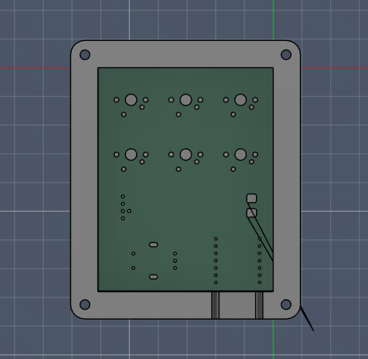
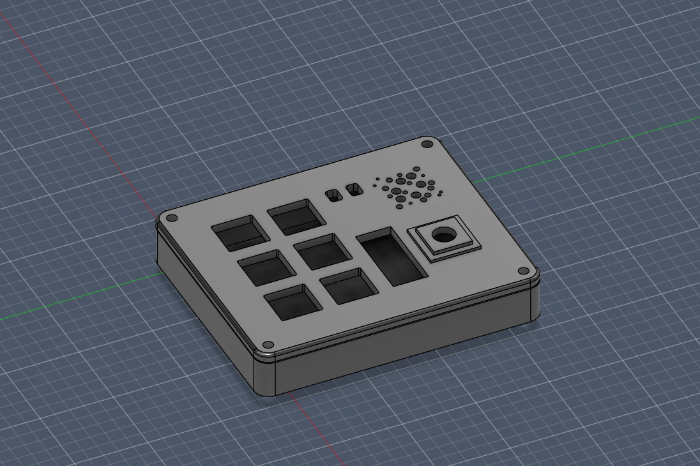
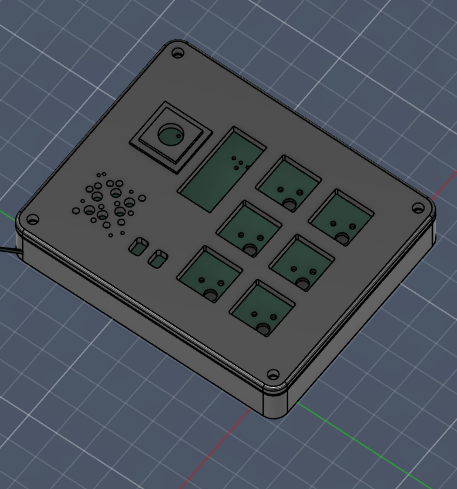
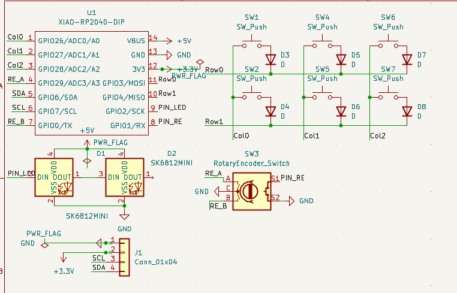
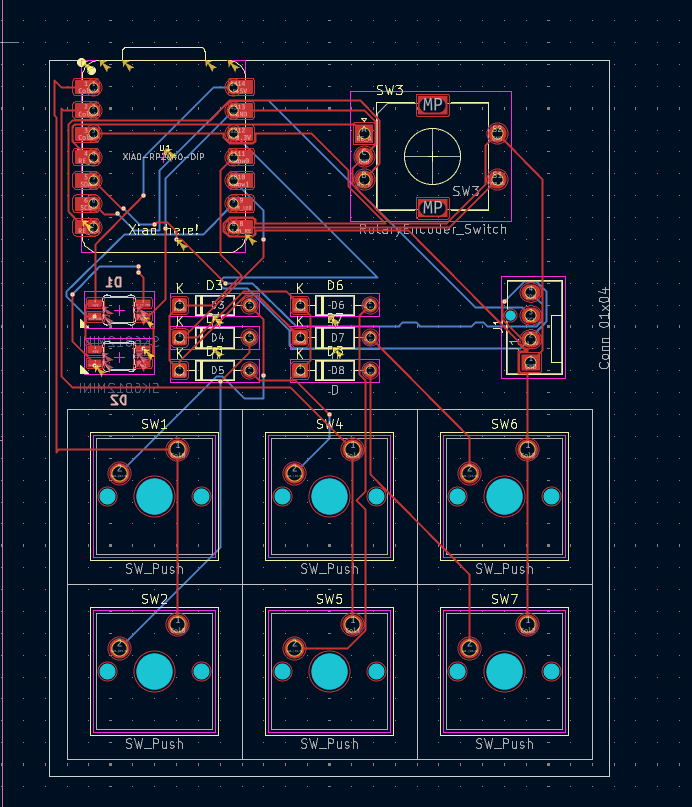

# Sumqzs_Multipad

First up sorry for any typos or grammar mistakes. English isn't my primary language but I've tried my best.

My own custom macropad. It's simple but includes a variety of features. It's supposed to make life with a 60% keyboard better. You get the space benefit of a small keyboard but still have extra buttons and features when needed. This project was made possible by blueprint.hackclub.

I made this product following the tutorial on blueprint.hackclub and added my own ideas. I've had a lot of fun and will probably be making another project soon.

If anyone wants to build something similar feel free to ask me about the process!

---

## Bill of Materials (BOM)

Here are all of the products used (example parts):

| Part | Quantity | Description | Part Number | Link |
|------|----------|-------------|-------------|------|
| Microcontroller | 1 | Seeed Studio XIAO RP2040 | XIAO-RP2040 | https://www.amazon.com/Microcontroller-Dual-Core-MicroPython-CircuitPython-Interfaces/dp/B09NNVNW7M |
| OLED Display | 1 | 0.91" I2C OLED 128x32 (SSD1306) | SSD1306 0.91" | https://www.ziotester.it/elettronica/display/ssd1306-display-oled-0-91-pollici-128-32-pixel.html |
| Mechanical Switch | 6 | PCB mount mechanical switch | Cherry MX compatible | https://www.cherry.de/en-gb/products/switches/mx-standard |
| Rotary Encoder | 1 | ALPS EC11 with push button | EC11E15244G1 | https://tech.alpsalpine.com/e/products/detail/EC11E15244G1/ |
| RGB LED | 2 | SK6812 Mini-E RGB LED | SK6812MINI-E | https://www.adafruit.com/product/4960 |
| PCB | 1 | Custom PCB | – | https://jlcpcb.com |
| Case (3D Print) | 1 | 3D printed enclosure | – | – |

Note: The linked parts are example references. Please double-check compatibility before ordering parts for your own build.

---

## Pictures

### Assembled (Top)

### Assembled (Angled View)

### Side View

### With Lid

---

## Schematic

The rotary encoder is supposed to not be connected on the S pins since i don't need the extra function. If you plan on replicating this schematic you can use a matrix to also utilize it!
## PCB Layout

## Case Design / 3D Model

---

## PCB Price

  

---

All needed files are included in the repository. Other files are sorted in folders.

The firmware is still not finished and will be updated once the parts are assembled.
