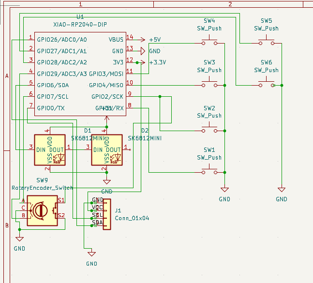
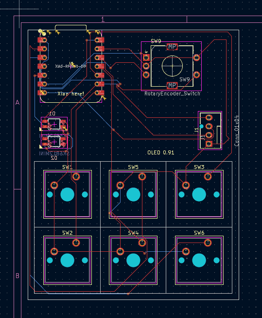
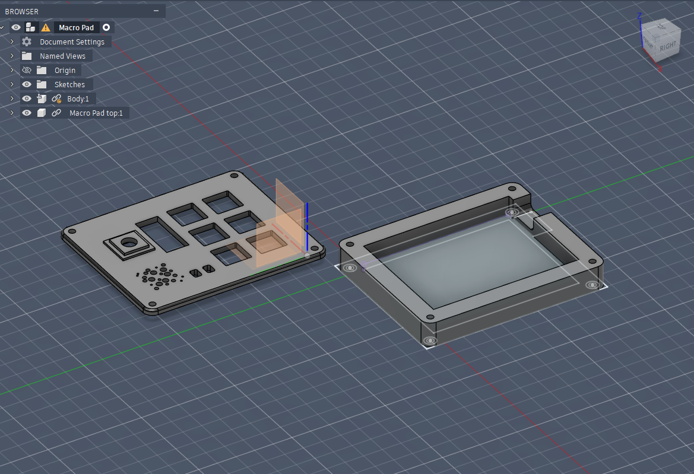

# Sumqzs_Multipad
First up sorry for any typos or grammar mistakes. English isn't my primary language but I've tried my best.

My own custom Macropad. It's simple but includes a variety of features. It's supposed to make life with a 60% Keyboard better. To get the space benefit of the small Keyboard but they possibility to add extra buttons and features when needed. This project was made possible by blueprint.hackclub

I made this product following the tutorial on blueprint.hackclub and added my own ideas I've had a lot of fun and will probably be making another project soon.

If anyone wants to build something similar feel free to ask me about the process!

## Bill of Materials (BOM)

here are all of the products used!

| Part | Quantity | Description | Part Number | Link |
|------|----------|-------------|---------------------|------|
| Microcontroller | 1 | Seeed Studio XIAO RP2040 | XIAO-RP2040 | https://www.seeedstudio.com/XIAO-RP2040-p-5026.html |
| OLED Display | 1 | 0.91" I2C OLED 128x32 (SSD1306) | SSD1306 0.91" | https://www.adafruit.com/product/4440 |
| Mechanical Switch | 6 | PCB mount switch | Cherry MX compatible | https://www.cherrymx.de/en/cherry-mx/mx.html |
| Rotary Encoder | 1 | ALPS EC11 with push button | EC11E15244G1 | https://www.lcsc.com/product-detail/Rotary-Encoders_ALPSALPINE-EC11E15244G1_C47023.html |
| RGB LED | 2 | SK6812 Mini-E RGB LED | SK6812MINI-E | https://www.lcsc.com/product-detail/RGB-LEDs_OPSCO-Optoelectronics-SK6812MINI-E_C5149201.html |
| PCB | 1 | PCB  | – | https://jlcpcb.com |
| Case (3D Print) | 1 | 3D printed enclosure | – | – |

All needed Files should be included in /assets/ the other files are sorted.

Here are some pictures!

I don't have the finished picture yet altough i will at them once i received all parts.

## Hackpad Overview

## Schematic

## PCB Layout

## Case Design / Assembly

To view the price of the PCB please look at the other files under the main folder!

The Firmware is still not finished and will also be updated once the parts are assembled!
